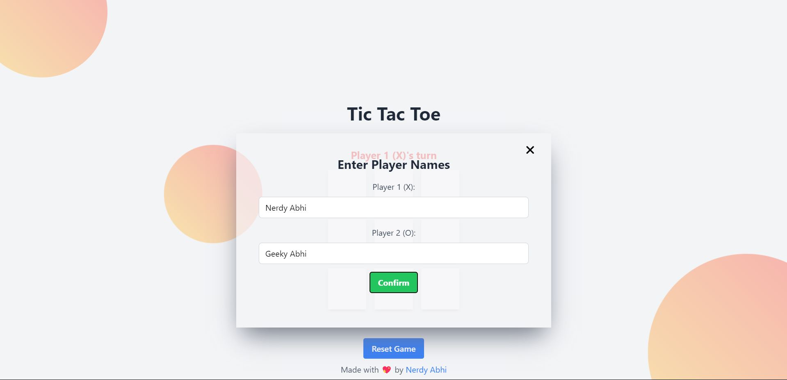
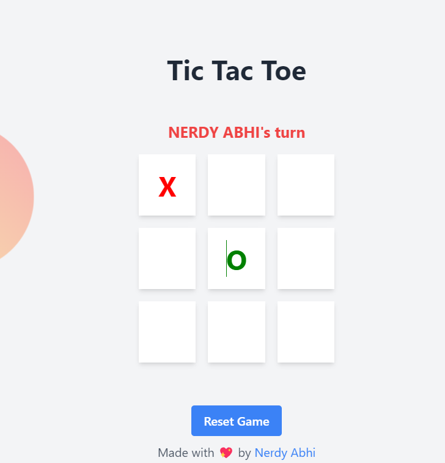
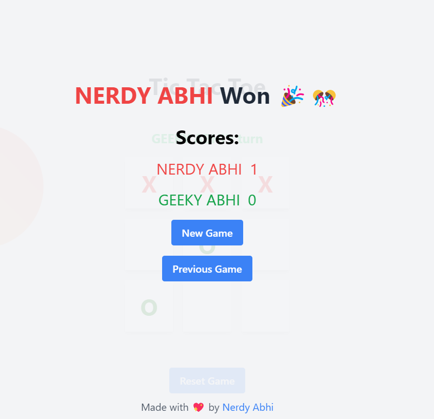

### Tic-Tac-Toe

### [Live Link 🔗](https://nerdyabhi.github.io/tic-tac-toe/)

One of the games i used to play with my friend in a boring lecture.

- Although , i made this project while learning javascript

- I took inspiration from 'APNA college's' tic-tac toe video but that's not it.

### Things i did on my own :

1. Made the UI as per my liking using tailwind css.
2. Added options , where one can enter player's name.
3. Who's turn is next ? implemented
4. And also the scores of both the players are stored.

5. Added a previous game option , where player can watch their previous game board

6. Made UI/UX a little better for mobile screens.

### Left for future:

- [ ] Add online multiplayer mode and matchmaking based on levels

- [ ] Add options where user can play VS computer

- [ ] User have their game data (including level of player) saved and can be acessed by logining.

- [ ] Open source this project.

## Screenshots

### Can change Player's name :

### show's who's turn is next

### Win Screen and Score Card

