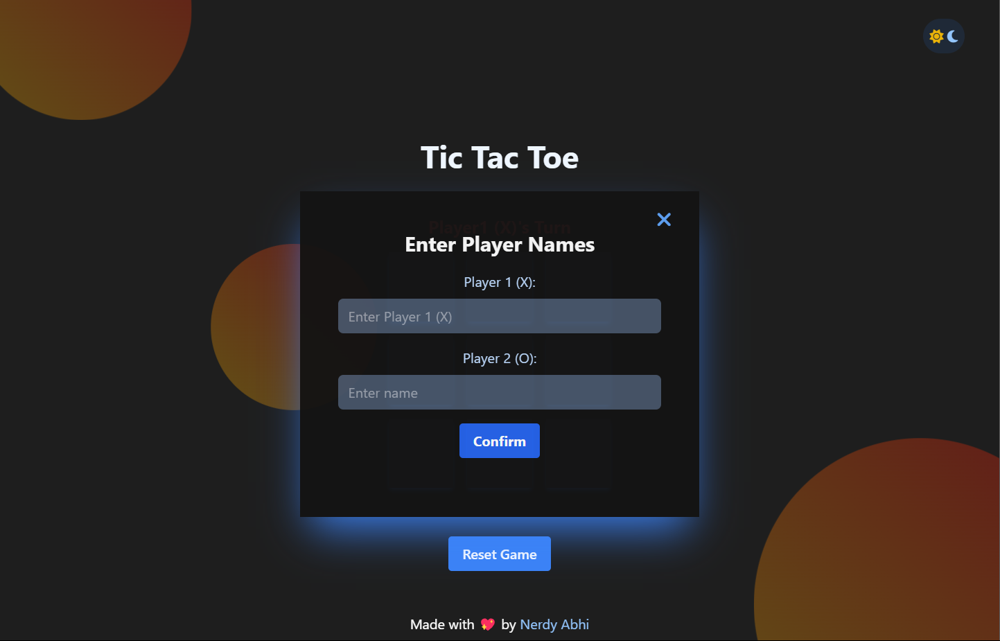

### Tic-Tac-Toe

### [Live Link 🔗](https://nerdyabhi.github.io/tic-tac-toe/)

One of the games i used to play with my friend in a boring lecture.
- Although , i made this project while learning javascript

### Version 2.1 Updates:
1. Used localstorage to store , player's name , theme and Mode

2. Better Dark Mode Theme

### Version 2.0 Updates:
1. Implemented a bot to play against user.
2. No more annoying popup for changing Name.
3. More Clean and Optimized Code.

4. New GIF's for Winscreen Etc.

### Some Hidden Features :
- You can press `space` or `d` to toggle (on/off) dark mode.
- You can click on `Player's Turn ` button to change their names as well
- You can use a particular pattern to win every time (as i haven't used minimax algorithm).

### Left for future:

- [ ] use Minimax algorithm and provide a `hard` Mode to play against user.

- [ ] Add online multiplayer mode and matchmaking based on levels

- [ ] User have their game data (including level of player) saved and can be acessed by logining.

## Screenshots

### New Game Modes:

### Can change Player's name :

### Win Screen and Score Card

